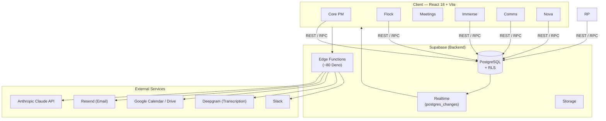

# Nexus

**Nexus** is a full-stack internal operations platform combining six distinct product domains — task management, contact relationship tracking, meeting intelligence, document reading with AI audio, email campaigns, and an AI assistant — under one shared authentication and multi-tenant permissions model. It is not a single-purpose tool but a purpose-built replacement for an off-the-shelf stack that had grown too fragmented for a distributed team.

Built as a production system over 18 months for a distributed volunteer organization of ~50 people across five departments, Nexus replaced a mix of ClickUp, shared spreadsheets, email chains, and manual weekly reporting. Every module was validated against real production use before it was considered complete; the platform has been in active daily operation since early 2026.

## Quick Links

- **[Maintainer Runbooks](docs/RUNBOOKS.md)** — deployments, incidents, emergency access, and recovery
- **[Architecture Diagram](docs/architecture/NEXUS_ARCHITECTURE.md)** — data flow, relationships, dependencies, and secret boundaries
- **[Features by Team](docs/FEATURES_BY_TEAM.md)** — ownership and escalation map
- **[Local Development Checklist](docs/LOCAL_DEV_SETUP.md)** — verified setup and first-run checks
- **[Code Tour](docs/CODE_TOUR.md)** — 30-minute maintainer walkthrough
- **[Permission Matrix](docs/PERMISSION_MATRIX.md)** — least-privilege access model
- **[Staging and Onboarding](docs/STAGING_AND_ONBOARDING.md)** — volunteer progression and staging baseline
- **[Incident Log](docs/INCIDENTS.md)** — production incident record
- **[Weekly Maintenance Template](docs/WEEKLY_MAINTENANCE_TEMPLATE.md)** — async maintenance update format
- **[Full Feature Catalog](docs/FEATURES.md)** — Complete breakdown of every feature
- **[Architecture Decisions](docs/architecture/decision-catalog.md)** — 49+ design rationales
- **[Security Guidelines](docs/SECURITY.md)** — RLS, JWT, auth patterns
- **[Deployment Guide](docs/deployment/)** — Production setup, migrations, secrets

---

## Modules

| Module | What It Does | Closest Commercial Analog |
|--------|-------------|--------------------------|
| [Core PM](./modules/core-pm/) | Task management, Kanban boards, sprint planning with team velocity tracking | Linear / ClickUp |
| [Flock](./modules/flock/) | Contact tracking, call logging, follow-up queues, manager workload view | Salesforce (simplified CRM) |
| [Meetings](./modules/meetings/) | AI-powered meeting capture — rich-text minutes, audio transcription, action item extraction | Otter.ai + Notion |
| [Immerse](./modules/immerse/) | PDF e-reader with AI text-to-speech, synchronized highlighting, note-taking, usage tracking | Scribd + Apple Books |
| [Comms](./modules/comms/) | Email broadcast campaigns, audience segmentation, RSVP and invitation management | Mailchimp / Customer.io |
| [Nova](./modules/nova/) | Role-aware AI assistant grounded in live organizational data and a curated knowledge base | ChatGPT Enterprise / Glean |

## Architecture



All six modules share the same Supabase project, user table, and JWT-based permissions model. There is no inter-service API; modules communicate through shared database tables and realtime subscriptions.

## Tech Stack

| Layer | Technology |
|-------|-----------|
| Frontend framework | React 18 + Vite 7 |
| Routing | React Router v6 (lazy-loaded, code-split per page) |
| Server state | TanStack React Query v5 |
| Database | Supabase PostgreSQL with Row-Level Security |
| Realtime | Supabase `postgres_changes` subscriptions |
| Edge Functions | ~80 Deno functions (Supabase) |
| Auth | Supabase Auth + custom token-based invite flow |
| Drag & Drop | @dnd-kit/core + sortable (tasks, Kanban, dashboard) |
| Rich text | Tiptap v3 (meeting minutes editor) |
| Charts | Recharts |
| PDF | pdf.js (document reader), jsPDF + html2canvas (report export) |
| AI | Anthropic Claude API (Nova assistant, meeting extraction) |
| Transcription | Deepgram (async audio-to-text) |
| Email | Resend + React Email component templates |
| Calendar sync | Google Calendar OAuth + push webhooks |
| Maps | Leaflet + MarkerCluster |
| Hosting | Vercel (frontend), Supabase Cloud (backend) |

## Security — RLS-First Design

Every table in the database has Row-Level Security enabled at the PostgreSQL layer — not in application code. Two JWT claims drive all access decisions:

- **`user_role`** — `member`, `dept_lead`, `regional_secretary`, `super_admin`
- **`user_department_id`** — scopes data visibility to the user's home department

Policy logic is centralized in reusable Postgres functions (`current_user_department()`, `current_user_role()`) rather than duplicated across table policies. Super admins cross department boundaries; regular users see only their department's data. Cross-department data sharing (sprint members from other teams, shared task lists) uses explicit join tables (`space_shares`, `meeting_attendees`) rather than loosened base policies. JWT claims are extracted on every Supabase request; no round-trip to a permissions table is needed.

The invite flow is token-based: invited users receive a signed link, complete their profile through a multi-step wizard, and are assigned a role and department at activation. No self-registration is possible.

## Setup

### Prerequisites

- Node.js 20+
- [Supabase CLI](https://supabase.com/docs/guides/cli)
- A Supabase project (or run locally with `supabase start`)

### Steps

**For the public demo environment:**
```bash
npm install
cp .env.demo.example .env.local
# Add your Supabase ANON_KEY to .env.local (from dashboard)
supabase db reset      # Loads all migrations + demo seed data
npm run dev
```
Then follow the Demo section above to create auth users and log in.

**For a custom Supabase project:**
```bash
npm install
cp .env.example .env.local
# Edit .env.local — fill in VITE_SUPABASE_URL and VITE_SUPABASE_ANON_KEY at minimum.
# Optional integration keys: Google OAuth, Slack, Deepgram, Anthropic, Resend.

supabase db push           # Apply all migrations (~18 months of schema history)
supabase functions deploy  # Deploy ~80 Deno edge functions
npm run dev
```

Edge functions each require their own environment secrets (Resend API key, Anthropic API key, Deepgram API key, etc.). Set these in the Supabase dashboard under Project Settings → Edge Functions → Secrets, or via `supabase secrets set`.

## Demo

A public demo Supabase project with seeded data is available for hands-on exploration.

**Quick Start:**

1. **Set up auth users** (one-time, in Supabase SQL Editor):
   ```bash
   # Follow: DEMO_AUTH_SETUP.md (step 1-2)
   # Creates 14 demo users in auth schema
   ```

2. **Load demo data:**
   ```bash
   cp .env.demo.example .env.local
   # Edit .env.local — add your ANON_KEY from Supabase dashboard
   supabase db reset
   ```

3. **Run locally:**
   ```bash
   npm run dev
   ```

4. **Log in as any demo user:**
   | Email | Role | Password |
   |-------|------|----------|
   | `maya@virtualllaunch.app` | Super Admin | `Demo123!@#` |
   | `alex@virtualllaunch.app` | Dept Lead (Social Media) | `Demo123!@#` |
   | `aria@virtualllaunch.app` | Dept Lead (Brand) | `Demo123!@#` |
   | `quinn@virtualllaunch.app` | Dept Lead (Content) | `Demo123!@#` |
   | `tori@virtualllaunch.app` | Dept Lead (Marketing) | `Demo123!@#` |
   | `jordan@virtualllaunch.app` | Member | `Demo123!@#` |
   | `morgan@virtualllaunch.app` | Member | `Demo123!@#` |

**Demo Organization:** Virtual Launch Inc. (product launch scenario with 5 departments, cross-functional sprints, 15 tasks, 4 meetings, and realistic comments).

See **[DEMO_AUTH_SETUP.md](./DEMO_AUTH_SETUP.md)** for detailed instructions and troubleshooting.

## Repository Status

This repository is a **sanitized portfolio edition** of Nexus. It contains:

- ✅ Complete application architecture and design patterns
- ✅ Clean database schema showcasing RLS and multi-tenancy
- ✅ Integration provider pattern (pluggable vendors)
- ✅ Synthetic demonstration data and seed
- ✅ Public engineering documentation

It does **not** contain:

- ❌ Production data or real user information
- ❌ Operational history (incident logs, specific fixes)
- ❌ Organization-specific configuration or business rules
- ❌ Credentials, API keys, or deployment secrets
- ❌ Vendor-specific implementations (see provider pattern)
- ❌ Private engineering runbooks or incident reports

**For recruiters**: This is a real portfolio project. The schema, code, and architecture are from the production system; operational details and configuration are maintained separately. See [SANITIZATION_CHECKLIST.md](./SANITIZATION_CHECKLIST.md) for the audit process.

## License

This codebase is published for portfolio and reference purposes. See [LICENSE](./LICENSE) for terms.
