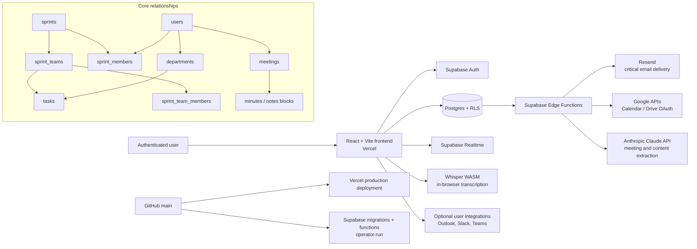

# Nexus Architecture

## Trust Boundaries

- Browser code uses only public Supabase configuration. It must never contain service-role, Resend, Anthropic, or OAuth client-secret values.
- Postgres RLS is the primary authorization boundary. UI visibility is not a substitute for an RLS policy.
- Edge Functions hold provider secrets and validate callers before privileged work.
- The MCP endpoint uses a personal API key and server-side permission checks; it is not authenticated by browser cookies.

## Dependency Classification

| Dependency | Classification | Degraded behavior |
| --- | --- | --- |
| Supabase Auth/Postgres/RLS | Critical | Sign-in and core reads/writes are unavailable. |
| Vercel | Critical for web access | Existing app cannot be served. |
| Resend | Critical for invitations, campaigns, and system email | In-app work continues; outbound email is delayed or fails. |
| Google Calendar / Drive | Important integration | Core tasks and meetings continue; sync/export fails. |
| Anthropic | Important AI enhancement | Meeting capture continues; extraction/summaries fail. |
| Whisper WASM | Optional client enhancement | Audio can be handled without local transcription. |
| Outlook, Slack, Teams | Optional integrations | Only the affected integration is unavailable. |

## Secret Locations

| Secret category | Location | Rotation path |
| --- | --- | --- |
| Browser-safe Supabase URL/anon key and public OAuth client IDs | Vercel environment variables / local `.env.local` | Update Vercel, redeploy, verify sign-in. |
| Service role, Resend, Anthropic, Google client secret | Supabase Edge Function secrets | Update secret, redeploy dependent function, run a narrow live test. |
| User OAuth tokens | Supabase Vault / database access layer | Reconnect only the affected user; never export tokens. |
| GitHub/Vercel/Supabase operator credentials | Provider account controls | Revoke from provider, then validate replacement access. |
